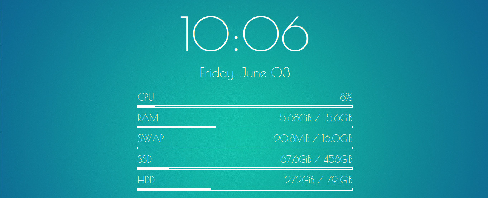

Clean Glass
===========

Clean Glass is a conky configuration made by Jack Massey that displays system
information on the desktop. The conky has been configured for usage with
Gnome 3.18 and a screensize of 1366x768.

Installation
------------

    1. Ensure that conky is installed and setup
    2. Copy conky.conf to ~/.config/conky/
    3. Edit conky.conf and set the configuration options.
    4. Run conky.conf

Configuration
-------------

There are numerous configuration options for Clean Glass to ensure that it
works correctly with your setup.

| name        | Description                               | Units      |
|-------------|-------------------------------------------|:----------:|
| width       | Total width of the conky widget           | (int) px   |
| top_gap     | Vertical displacement                     | (int) px   |
| large_text  | font size of the clock                    | (int) px   |
| medium_text | fontsize of the date                      | (int) px   |
| small_text  | fontsize of the displays                  | (int) px   |
| bar_text    | Effects the gap between text and usagebar | (int) px   |
| color       | The global font colour to use             | #(hex rgb) |

Author
------
Jack Massey <jacknmassey@gmail.com>

Licence
-------
**GPLv3**

See `LICENCE` for more information
